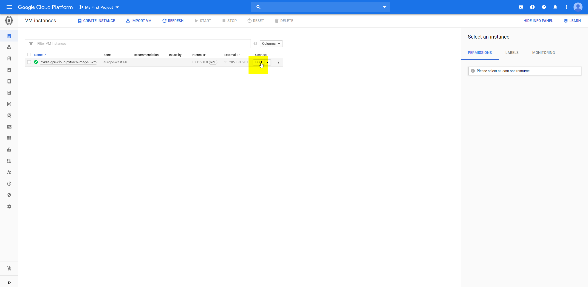
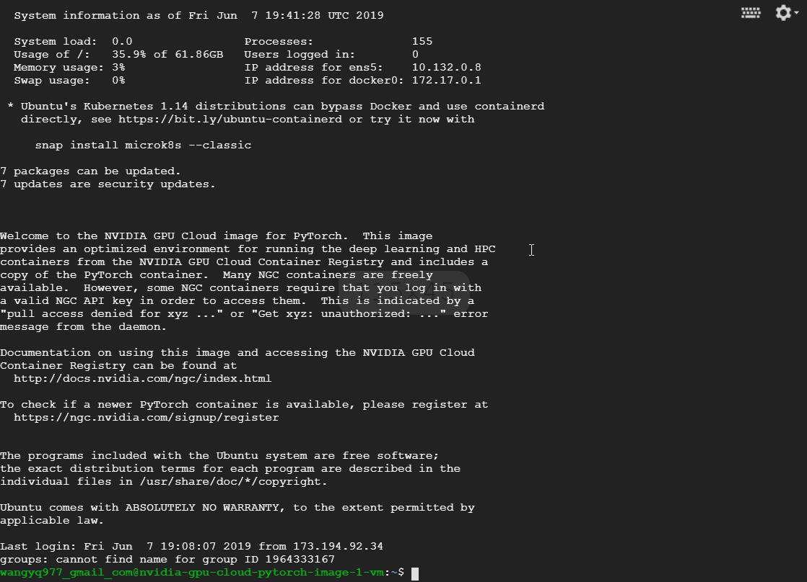

cil-2019
========

**DO NOT COMMIT OR PUSH TO DEVELOP/MASTER**
-------------------------------------------

Train command
-------------

1. login (after email confirmation) |login|
2. select compute engine |gcp-gce|
3. ssh into terminal |gce-ssh|

.. code:: shell

    # add sudo before each command
    sudo bash
    docker ps -a 
    # CONTAINER ID        IMAGE               COMMAND             CREATED             STATUS              PORTS               NAMES
    # ae2f6abc24d5        ufoym/deepo         "bash"              2 hours ago         Up About an hour    6006/tcp            eager_ganguly
    docker ps -a -q
    # ae2f6abc24d5
    # entering the bash with container ID
    docker exec -it ae2f6abc24d5 bash

    # exit docker container
    exit

    # exit ssh
    exit

Master branch
-------------

``master`` branch contains the final version

Do not commit or re-branch until submission

Develop branch
--------------

Make pll request from ``feature/wyq`` to ``develop`` branch after
testing.

Code should be reviewed before merging into ``develop`` branch.

Code in develop branch should pass the submission requirements.

Logistics
---------

Links:
~~~~~~

1. `Projects
   description <http://da.inf.ethz.ch/teaching/2019/CIL/project.php>`__
2. `Road
   seg <https://inclass.kaggle.com/c/cil-road-segmentation-2019>`__
3. `Road seg kaggle sign
   in <https://www.kaggle.com/t/c83d1c6de17c433ca64b3a9174205c44>`__
4. `Link for
   dataset.zip <https://storage.googleapis.com/public-wyq/cil-2019/cil-road-segmentation-2019.zip>`__

.. code:: bash

    wget https://storage.googleapis.com/public-wyq/cil-2019/cil-road-segmentation-2019.zip

Computational resources
~~~~~~~~~~~~~~~~~~~~~~~

1. https://scicomp.ethz.ch/wiki/Leonhard
2. https://scicomp.ethz.ch/wiki/CUDA\_10\_on\_Leonhard#Available\_frameworks
3. https://scicomp.ethz.ch/wiki/Using\_the\_batch\_system#GPU

Project submission
~~~~~~~~~~~~~~~~~~

1. Submit the final report:
   https://cmt3.research.microsoft.com/ETHZCIL2019
2. Signed form here:
   http://da.inf.ethz.ch/teaching/2019/CIL/material/Declaration-Originality.pdf
3. Kaggle: https://inclass.kaggle.com/c/cil-road-segmentation-2019

.. |login| image:: gcp-login.png

